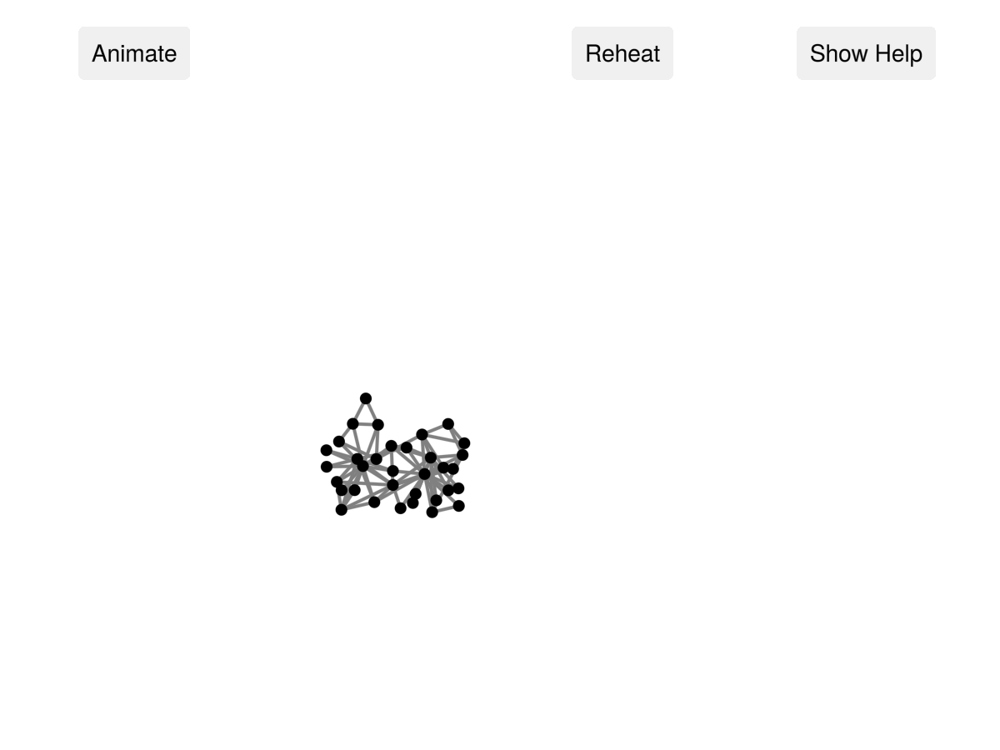

# GraphPlayground.jl

[](https://dgleich.github.io/GraphPlayground.jl/stable/)
[](https://dgleich.github.io/GraphPlayground.jl/dev/)
[](https://github.com/dgleich/GraphPlayground.jl/actions/workflows/CI.yml?query=branch%3Amain)
[](https://codecov.io/gh/dgleich/GraphPlayground.jl)
[](https://github.com/JuliaTesting/Aqua.jl)

Directly play and manipulate your graphs in Julia! This is hugely inspired by the
[d3-force](https://d3js.org/d3-force) package. This includes a port of this
package to Julia to handle the force directed layout. 

Usage
-----
Using it should be as simple as giving the graph (right now, this has to be a graph from `Graphs.jl`) you want to play with to the playground function. 
```
using Graphs, GraphPlayground
g = smallgraph(:karate)
playground(g)
```
This should open an interactive window that will visualize the graph. 



But for such a small graph, I find the following looks better. 
```
playground(g; 
  link_options=(;distance=25), 
  charge_options=(;strength=-100))
```

Unfortunately, tweaking the options is a real thing with this package. Future plans include slightly better automated choices. 

Grids or very highly spatial graphs require a little bit more fussing.
```
using Graphs, GraphPlayground, GeometryBasics
g = grid([100,100]) # make a 100x100 grid from Graphs
p = playground(g, 
  ForceSimulation(Point2f, vertices(g); 
    link=LinkForce(;edges=edges(g), iterations=10, distance=0.5, strength=1),
    charge=ManyBodyForce(;strength=-1), 
    center=PositionForce(target=Point2f(300,300)));
  graphplot_options = (;node_size=[2 for _ in 1:nv(g)], edge_width=[1.0 for _ in 1:ne(g)]))
display(p)     
p.sim.alpha.alpha_target = 0.5 # keep the simulation hot for a while
```


This does a few things differently. The defaults are setup for graphs of around 100 nodes. 
- The code explicitly creates a force simulation. This is what controls how the graph layout works.
- The force simulation is setup to have: link attractive forces, node/charge repulsion forces, 
  and centering forces. 
- The LinkForce gives an edge-attraction forces have an ideal distance of 0.5, 
  the iterations parameter controls how many times we iterate over edges updating velocity vectors. 
  For grids, we want this to be large, but the default value of 1 is okay unless you have a ton of structure.
- The ManyBodyForce handles the node repulsion. strength=-1 is good if you want nodes close by, such as for
  a large graph. 
- The center force / Position force seeks to push all nodes to point (300, 300), this is roughly in the 
  middle of the display area. 
- Because the graph is so big, we adjust the default sizes to 2 points for a node and 1 point for an edge. 
- Finally, we want to keep the simulation "hot" so it doesn't decay too quickly. (Grids take a long time 
  to settle, so we setup the alpha_target to be 0.5.)

See the excellent documentation for d3-force for more information on the force simulation and some 
of the parameters.

- [https://d3js.org/d3-force/link]
- [https://d3js.org/d3-force/many-body]
- [https://d3js.org/d3-force/position]

To get the positions of the nodes, just call

```
p = playground(g)
xy = p.sim.positions 
```

This will return an array of node positions. 


Important Note
--------------
Right now, GraphPlayground is setup with `GLMakie.jl` to create a window that continuously renders. 
This has an odd side effect that it makes printing to the console slow. So you will
see this. Just close the GraphPlayground window and it'll go away. 

Requirements
------------
- `GLMakie`: This is required to implement a window with a callback on each frame. 
- `GraphMakie`: This is required for the graph plotting code
- `NearestNeighbors`: This is required for the balltree to implement the distant cell
  approximation in the ManyBodyForce and CollisionForce
- `Graphs`: This is what we use to interact with GraphMakie
- `Colors`: I guess we need this to specify plot colors
- `Makie`: Just general Makie code as well. 

Standard libraries
------------------
- `Random`: We use random data. 
- `LinearAlgebra`: This is used for norms and dot products. 

